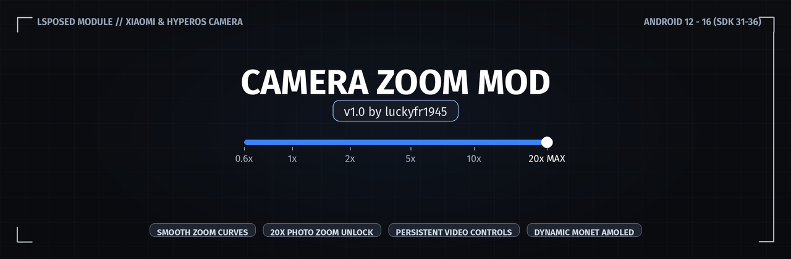

# Camera Zoom Mod

LSPosed xposed module for Xiaomi / HyperOS stock camera (`com.android.camera`). Customizes zoom animation curves, unlocks up to 20x digital zoom in photo mode, and prevents zoom controls from disappearing during video recording.

## Features

- **Smooth Zoom Curve**: Replaces linear zoom stepping with an ease-out transition curve. Configurable animation duration from 100ms to 1000ms via slider.
- **20x Photo Zoom Unlock**: Overrides stock vendor zoom limits to allow up to 20x zoom ratio with instant preset buttons (0.6x, 1x, 2x, 5x, 10x, 20x).
- **Video Zoom Panel**: Keeps zoom selection buttons accessible while actively recording video instead of collapsing or locking.
- **AMOLED Interface**: Pure black theme with Android 12+ Monet dynamic color support.
- **Multilingual**: Supports English, Indonesian, Simplified Chinese, Traditional Chinese, Japanese, Russian, Spanish, Brazilian Portuguese, Turkish, and Vietnamese.

## Requirements

- Android 12 to Android 16 (SDK 31 - 36)
- Root access via Magisk, KernelSU, or APatch
- LSPosed framework (Zygisk release or modern fork)
- MIUI / HyperOS Camera app (`com.android.camera`)

## Installation

1. Download the latest `app-release.apk` from the Releases page.
2. Install the APK on your device.
3. Open LSPosed Manager, navigate to Modules, and enable **Camera Zoom Mod**.
4. Ensure **Camera** (`com.android.camera`) is selected in the module scope.
5. Force close the Camera app or reboot your device.
6. Open Camera Zoom Mod to adjust your zoom transition and toggle features.

## Building from Source

Prerequisites:
- Android SDK (API 36 / Android 16 platform)
- JDK 17 or higher

Clone the repository and build using Gradle:

```bash
git clone https://github.com/luckyfr1945/cam-mod.git
cd cam-mod
./gradlew assembleRelease
```

The compiled APK will be generated at:
```text
app/build/outputs/apk/release/app-release.apk
```

## Tested Environments

- Device: Redmi Note 11 Pro 5G / POCO X4 Pro 5G (veux / peau)
- OS: Android 16 (SDK 36) / HyperOS
- Target Package: `com.android.camera`
- Framework: LSPosed v1.9.3+

## License & Credits

- Author: luckyfr1945
- Framework: Built with YukiHookAPI
- License: Open source under Apache 2.0
